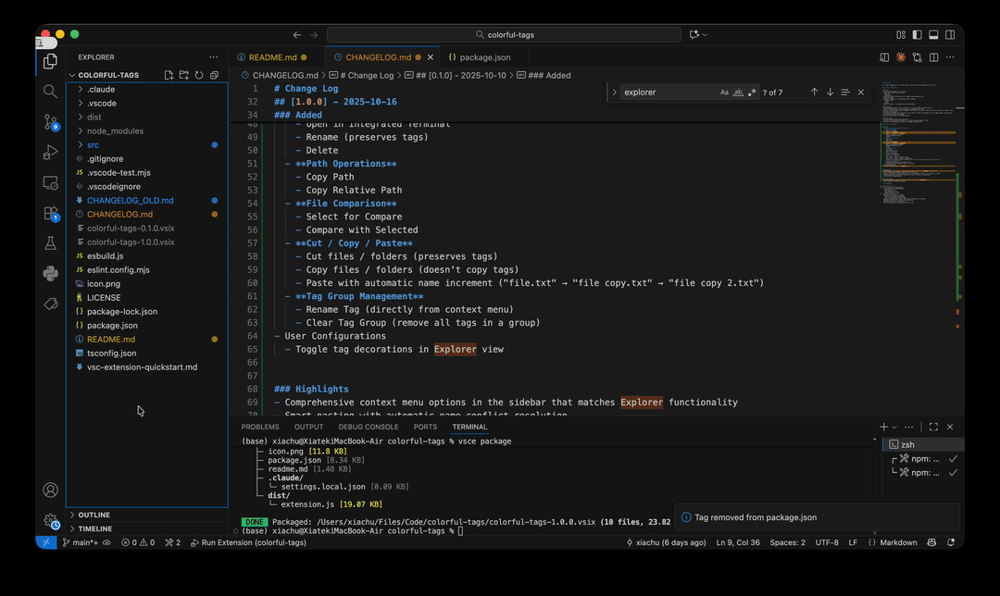
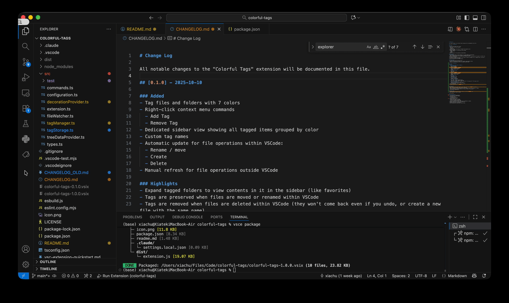
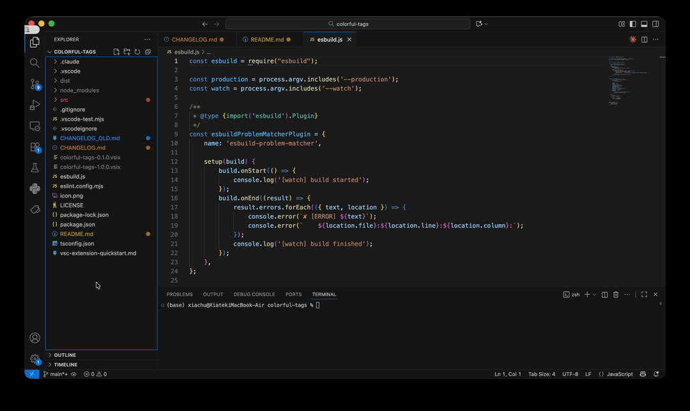
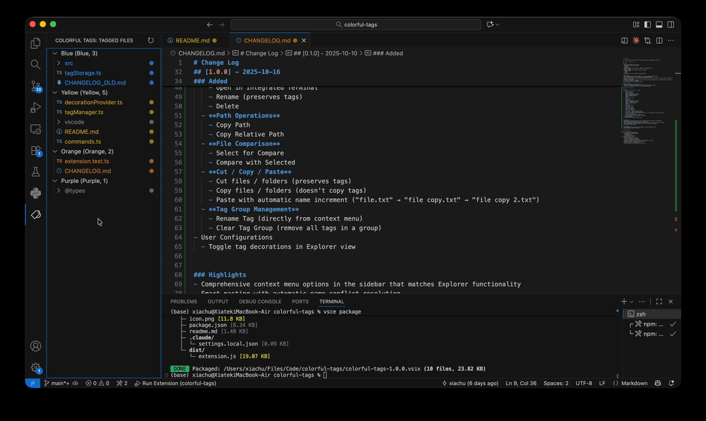
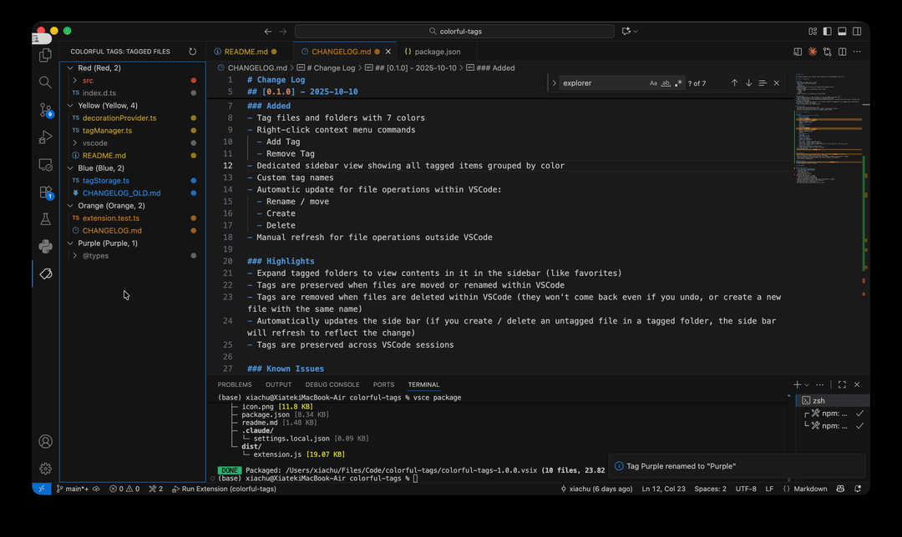

# Colorful Tags

Tag / favorite FILES and FOLDERS with colorful tags.

## Features

### 🎨 Tag Files and Folders
Right click to add / change / remove tags with 7 vibrant colors.

### 📋 Sidebar View
A dedicated sidebar displays all tagged items grouped by color.

Tips: You can drag the sidebar to reposition it, e.g. move it into the Explorer panel.

### 🖱️ Comprehensive Context Menu
Comprehensive context menu options in the sidebar that matches Explorer functionality.

### ✏️ Customize Tag Names
Give an alias to your tags.

### 🔄 Automatic Updates
Automatically update tags for file operations within VSCode.

## Usage

**Add / change a tag**: Right-click file/folder → "Colorful Tags: Add Tag" → Choose color

**Remove a tag**: Right-click tagged item → "Colorful Tags: Remove Tag"

**Rename tag**: Right-click tag group in sidebar → "Colorful Tags: Rename Tag"

**Refresh**: Click refresh button (↻) in sidebar toolbar after external file operations

## Requirements

- VS Code 1.58.0 or higher

---

## Feedback & Issues

Found a bug or have a feature request? Please open an issue on [GitHub](https://github.com/ronchuxia/VSCode-Colorful-Tags/issues).

**Enjoy organizing your workspace!** 🎨
